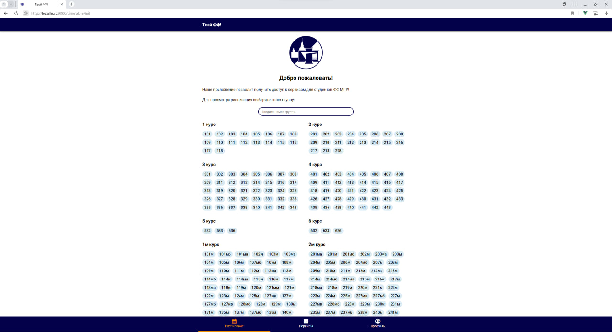

# Фронтенд приложения "Твой Физфак!"

[</img>](https://easycode.profcomff.com/templates/docker-node/workspace?mode=manual&param.Repository+URL=https://github.com/profcomff/webapp-ui.git&param.Working+directory=webapp-ui)

## Как начать\*

1. [Установите](https://git-scm.com/book/ru/v2/Введение-Установка-Git) систему контроля версий `git`;
2. Проверьте успешность установки с помощью команды

   ```bash
   git --version
   ```

3. **Склонируйте репозиторий:**
   В необходимой директории выполните в консоли команду

   ```bash
   git clone https://github.com/profcomff/webapp-ui
   ```

Появится папка `webapp-ui` с исходным кодом проекта.

3. [Установите](https://nodejs.org/en/download) среду выполнения языка JavaScript `Node.js`;

4. Проверьте успешность установки с помощью команды

   ```bash
   node --version
   ```

5. Вместе с `Node.js` у вас установится пакетный менеджер по умолчанию — `npm`. Рекомендуем использовать более совеременный вариант — `pnpm`. Для его установки выполните

   ```bash
   npm install --global pnpm
   ```

6. Для установки зависимостей проекта выполните команду

   ```bash
   pnpm install
   ```

7. Для запуска проекта локально выполните команду

   ```bash
   pnpm run dev
   ```

8. Введите в адресной строке браузера `http://localhost:9000`. Откроется главная страница приложения "Твой ФФ!".
   

\* при возникновении проблем пишите в наш телеграм-чат или [@physphile](t.me/physphile).

## Инструменты разработчика

1. **Среда разработки**.
   В последние годы самым популярным редактором кода стал `Visual Studio Code` (не путать с `Visual Studio`!). Необходимо [установить](https://code.visualstudio.com/download) именно его и несколько полезных плагинов, таких как

   - [Vue Language Features (Volar)](https://marketplace.visualstudio.com/items?itemName=Vue.volar)
   - [TypeScript Vue Plugin (Volar)
     ](https://marketplace.visualstudio.com/items?itemName=Vue.vscode-typescript-vue-plugin)
   - [ESLint](https://marketplace.visualstudio.com/items?itemName=dbaeumer.vscode-eslint)
   - [Prettier - Code formatter](https://marketplace.visualstudio.com/items?itemName=esbenp.prettier-vscode)
   - [Auto Close Tag](https://marketplace.visualstudio.com/items?itemName=formulahendry.auto-close-tag)
   - [Auto Rename Tag](https://marketplace.visualstudio.com/items?itemName=formulahendry.auto-rename-tag)
   - [Auto Import](https://marketplace.visualstudio.com/items?itemName=steoates.autoimport)
   - [CSS Variable Autocomplete](https://marketplace.visualstudio.com/items?itemName=vunguyentuan.vscode-css-variables)

2. **Самое главное** для веб-разработки у вас, безусловно, было установлено всегда и вы этим активно пользуетесь. Конечно, я говорю о браузере. В целом можно использовать любой браузер последней версии, но я советую `Google Chrome`. Нововведения первыми появляются в нем, удобная панель разработчика. Опыт в других браузерах на движке `chromium`, например, в `Яндекс Браузере`, будет аналогичным. Непременно стоит установить расширение [Vue.js devtools](https://chrome.google.com/webstore/detail/vuejs-devtools/ljjemllljcmogpfapbkkighbhhppjdbg) для просмотра дерева компонентов, отслеживания их состояния и общего состояния приложения.

## Обучающие материалы

В первую очередь необходимо знание "трёх китов" веб-разработки, а именно `HTML`, `CSS` и `JavaScript`. Обучающие материалы о них лезут из каждого угла, но нет ничего лучше, чем:

- [HTML для Начинающих - Практический Курс](https://www.youtube.com/watch?v=DOEtVdkKwcU),
- [CSS для Начинающих - Практический Курс](https://www.youtube.com/watch?v=SpCUuyZZTp8),
- [JavaScript Основы для Начинающих - Полный Курс за 6 часов](https://www.youtube.com/watch?v=Bluxbh9CaQ0).

Если понять `HTML` и `CSS` можно за пару вечеров, то вот изучение JavaScript может затянуться. Поэтому, если вам удобнее текстовый формат, используйте [Современный учебник JavaScript](https://learn.javascript.ru/), который охватывает все вожмости языка, а информация в нем структурирована и хорошо переведена на русский язык не одним годом работы разработчиков.

Проект построен на JavaScript-фреймворке `Vue.js` версии 3 с синтаксисом `Composition API`с использованием `TypeScript`. Если какие-то термины для вас оказались непонятными, не отчаивайтесь! В Сети полно замечательного обучающего контента, на котором, в т. ч. учился автор:

- [Vue 3 Основы для Начинающих - Полный Курс](https://www.youtube.com/watch?v=p059z-0JTFg),
- [TypeScript - Быстрый Курс за 70 минут](https://www.youtube.com/watch?v=nyIpDs2DJ_c),
- [TypeScript для продвинутых за 2 часа](https://www.youtube.com/watch?v=7NU6K4170As),
- [Продвинутые дженерики в TypeScript](https://www.youtube.com/watch?v=YDTZpQrBXjc).

Напоминаем:

> Чтобы научиться программировать, нужно программировать.

Поэтому, пожалуйста, смотрите код, задавайте много вопросов и пытайтесь его редактировать!

## Следующие шаги

[Архитектура приложения](/src/README.md)
