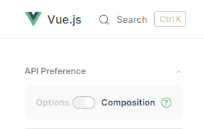
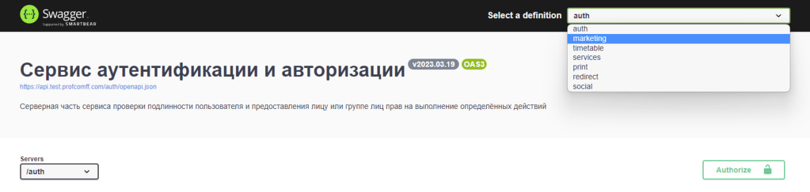
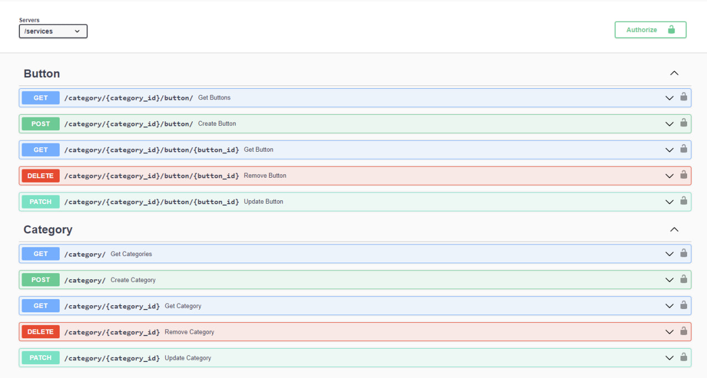

# Архитектура приложения

## Используемые технологии

1. Основой приложения служит фреймворк `Vue.js` в купе с синтаксисом `Composition API`. Актуальная документация на английском находится [здесь](https://vuejs.org/guide). Убедитесь, что переключатель стоит в значении `"Composition"`:



2. Библиотека `Vue Router` отвечает за роутинг в приложении: сопоставляет url-адрес с компонентами интерфейса, перенаправляет с одного адреса на другой и выполняет функции при навигации (например, отправляет метрики). Актуальная документация на английском [здесь](https://router.vuejs.org/guide/).

3. Данные, доступные для всего приложения (стейт) хранятся с помощью библиотеки `Pinia`. Она позволяет удобно создавать реактивные объекты, вычисляемые свойства и методы изменения стейта. Актуальная документация на английском [здесь](https://pinia.vuejs.org/introduction.html).

## Использование данных в компоненте

Все компоненты используют данные из стейта. Когда необходимо, эти данные в стейт загружаются с помощью методов api. Рассмотрим пример.

При загрузке страницы сервисов мы хотим отобразить кнопки. Если их нет в стейте, загружаем их с сервера.

```typescript
const appsStore = useAppsStore(); // создаем переменную для стейта

if (!appsStore.categories) {
	// метод getCategories(), описанный в controllers, загружает
	// категории сервисов вместе с кнопками и кладет их в стейт
	await ServicesApi.getCategories([CategoryInfo.Buttons]);
}

<template>
	<section v-for="{ name, type, buttons, id } of appsStore.categories" class="section" :key="id">
            // верстка
	</section>
</template>
```

## Добавление методов api

Все методы api описаны в [Swagger](https://api.test.profcomff.com/). На клиенте эти методы обрабатываются с помощью классов, описанных в `src/api`. Стоит отметить, что в данном месте методы не должны быть связаны с интерфейсом и не должны изменять стейт приложения.

Можно выделить некоторую иерархию api:

1. _Части_ api. Это семантическое разделение на методы, отвечающие за расписание, аутентификацию, сервисы и т. д. Вы можете найти их в выпадающем списке:
   

2. _Группы_ методов api. Это разделение методов по сущности, с которой они работают, будь то событие в расписании, пользователь, кнопки сервисов и т. д. Вы можете увидеть их в секциях на странице определенной _части_ api. Например, для api сервсиов определены сущности `Button` и `Category`:
   

3. Непосредственно _методы_ api. На картинке выше это разноцветные разворачивающиеся секции, в которых описаны принимаемые параметры, тип тела запроса и тип ответа.

Поэтому, у вас могут возникнуть различные случаи.

1. Добавление _части_ api. В таком случае необходимо:

   1.1. Создать в директории `src/api` папку с соответствующим именем. Например `cats`:

   

   1.2. Создать в папке `cats` базовый класс `CatsApi`, унаследованный от `BaseApi`

   ```typescript
   // src/api/cats/CatsApi.ts
   import { BaseApi } from '../BaseApi.ts';

   export class CatsApi extends BaseApi {
   	constructor() {
   		super('/cats');
   	}

   	public meow() {
   		alert('meow!');
   	}
   }
   ```

   1.3. Экспортировать инстанс данного класса:

   ```typescript
   // src/api/cats/CatsApi.ts

   // export class CatsApi ...

   export const catsApi = new CatsApi();
   ```

   ```typescript
   // src/api/cats/index.ts
   // export ...
   export { catsApi } from './CatsApi.ts';
   ```

   1.4 Теперь можно использовать новое api!

   ```typescript
   import { catsApi } from '@/api/cats';

   catsApi.meow();
   ```

2. Добавление _группы методов_ в существующую _часть_ api. В данном случае необходимо в папке соответствующей _части_ api создать класс, унаследованный от базового класса этой _части_ api.

3. Добавление _метода_ в уже существующую _группу методов_ определенной _части_ api. В этом случае достаточно лишь найти файл класса, описывающий данную группу и добавить метод.
